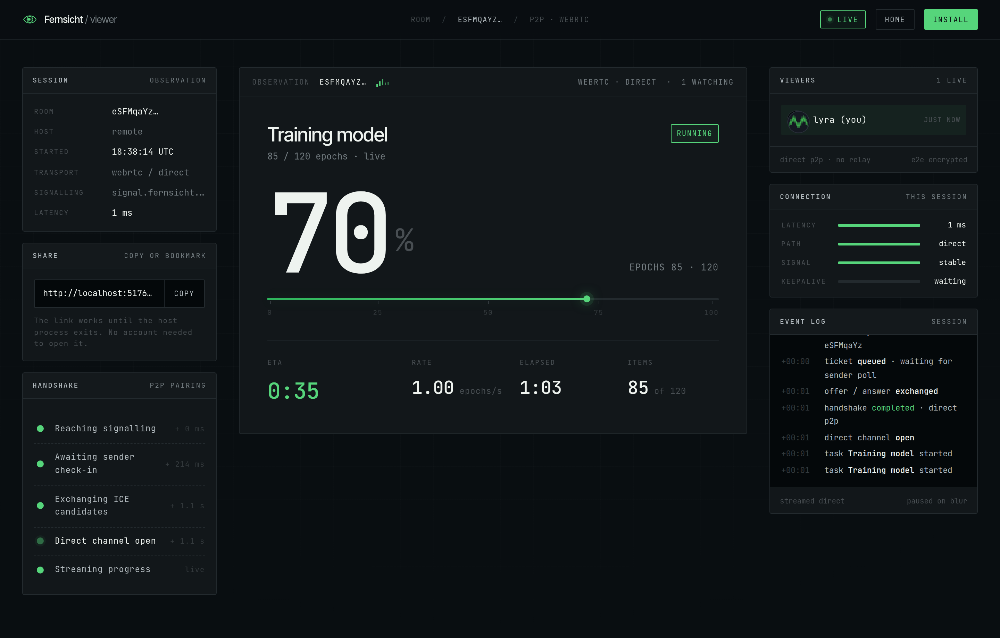
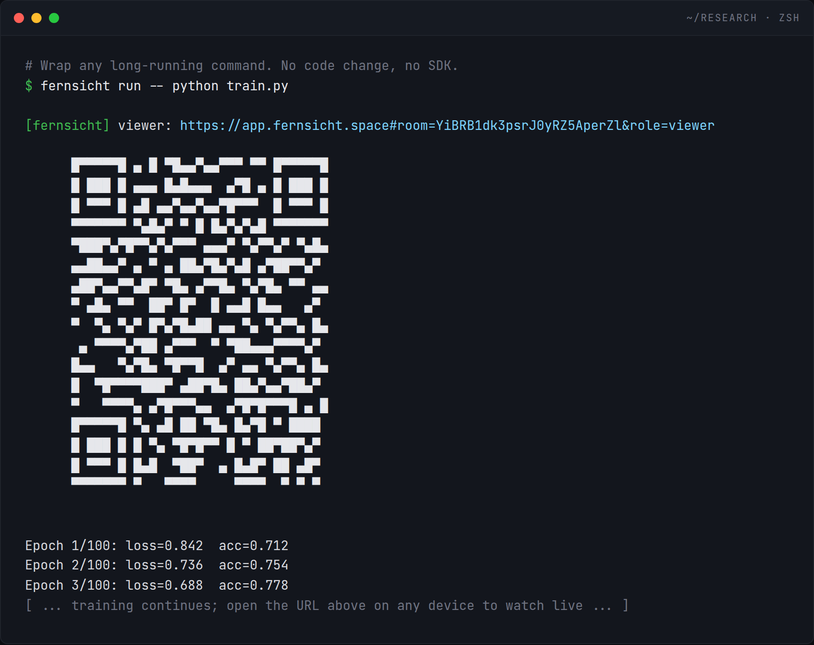
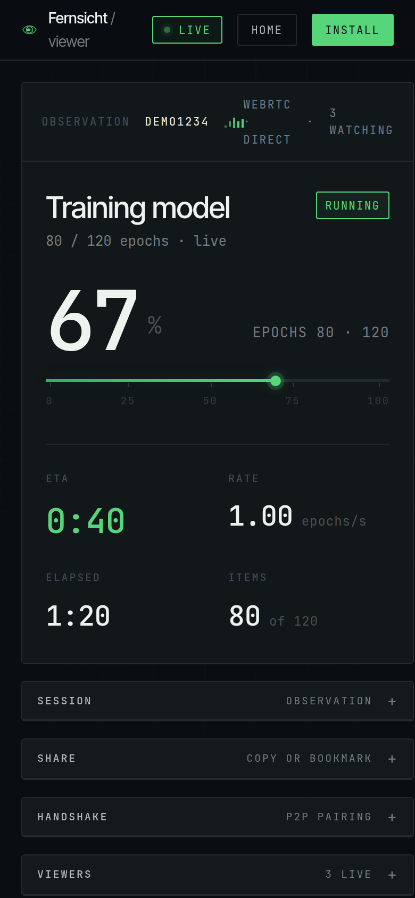

<p align="center">
  
</p>

<h1 align="center">Fernsicht</h1>

<p align="center">
  Watch your long-running jobs finish — from your phone, from a train, from anywhere. No signup, no code changes.
</p>

<p align="center">
  <a href="https://app.fernsicht.space">Live App</a>
  ·
  <a href="https://github.com/MuteJester/Fernsicht/issues">Report an Issue</a>
  ·
  <a href="https://ko-fi.com/fernsicht">Support on Ko-fi</a>
</p>

<p align="center">
  <a href="https://github.com/MuteJester/Fernsicht/actions/workflows/ci.yml"></a>
  <a href="https://pypi.org/project/fernsicht/"></a>
  <a href="https://pypi.org/project/fernsicht/"></a>
  <a href="https://github.com/MuteJester/Fernsicht/releases/latest"></a>
  <a href="./LICENSE"></a>
</p>

<p align="center">
  
</p>

---

## Why Fernsicht

You kicked off a 6-hour training run, a nightly ETL, or a long bioinformatics pipeline. You want to know whether it's still alive and how far along — without SSH'ing back in, without opening a wandb account, without instrumenting your code.

Fernsicht wraps a command you already run and streams its progress (elapsed, ETA, items/sec, count) to a web viewer you can open on any device.

- **No signup, no account, no config.** A viewer URL is printed to your terminal — share it, bookmark it, open it on your phone.
- **No code changes.** `fernsicht run -- your-command` auto-detects tqdm, pip, snakemake, and similar progress formats.
- **Your data stays yours.** Progress streams directly between your sender and viewer — never through a middleman.

## Quick Start

<details open>
<summary><b>CLI — wraps any command, in any language</b></summary>

### 1. Install

**macOS / Linux**
```bash
curl -fsSL https://github.com/MuteJester/Fernsicht/releases/latest/download/install.sh | sh
```

**Windows (PowerShell)**
```powershell
irm https://github.com/MuteJester/Fernsicht/releases/latest/download/install.ps1 | iex
```

Verify:
```bash
fernsicht --version
```

### 2. Wrap any long-running command
```bash
fernsicht run -- python train.py
fernsicht run -- snakemake --cores 4
fernsicht run -- pip install pandas
```

Auto-detects tqdm / pip / snakemake-style output. For explicit progress from any program, emit lines prefixed with `__fernsicht__`.

<p align="center">
  
</p>

See [`cli/README.md`](cli/README.md) and [`cli/docs/`](cli/docs/) for flags, recipes, and troubleshooting.
</details>

<details>
<summary><b>Python SDK</b></summary>

### 1. Install
```bash
pip install fernsicht
```

### 2. Wrap your loop
```python
import time
from fernsicht import blick  # "blick": German for glance — a companion to "Fernsicht" (far view)

for _ in blick(range(100), desc="Training"):
    time.sleep(0.1)
```
</details>

<details>
<summary><b>R SDK</b></summary>

### 1. Install

Requires a working C toolchain (Rtools on Windows, Xcode CLT on macOS, build-essential on Linux).

```r
remotes::install_github("MuteJester/Fernsicht", subdir = "publishers/r")
```

### 2. Wrap your loop
```r
library(fernsicht)

result <- blick(1:100, function(i) {
  Sys.sleep(0.1)
  i * 2
}, label = "Training")
```
</details>

After starting your job, a shareable viewer URL is printed. Open it on any device to watch the run in real time.

## Open it anywhere

Phone on the bus, tablet on the couch, second monitor at the desk — the viewer is responsive and designed for glanceability. Bookmark a room URL and it keeps working for the life of the run.

<p align="center">
  
</p>

## Progress Data

Each update the viewer receives includes:

| Field | Example | Description |
|-------|---------|-------------|
| Fraction | `0.4523` | 0.0 to 1.0 |
| Elapsed | `12.3s` | Time since start |
| ETA | `~15s` | Estimated time remaining |
| Count | `452 / 1,000` | Items completed / total |
| Rate | `36.7 it/s` | Items per second |
| Unit | `it`, `epochs`, `files` | Customizable label |

## Self-Hosting

Fernsicht is AGPL-3.0 and fully self-hostable. Point any publisher at your own endpoint:

```bash
export FERNSICHT_SERVER_URL="https://your-signal-domain"
```

## Repository Layout

```text
cli/             Go CLI — `fernsicht run -- <command>` (no SDK, no code change)
bridge/          Shared Go bridge used by the CLI and SDKs
frontend/        Viewer web app → app.fernsicht.space
publishers/
  python/        Python SDK (pip install fernsicht)
  r/             R SDK (remotes::install_github(...))
```

## Community & Support

- Bugs, feature requests, recipes — [github.com/MuteJester/Fernsicht/issues](https://github.com/MuteJester/Fernsicht/issues)
- Security disclosures — see [`SECURITY.md`](SECURITY.md)
- Enjoying Fernsicht? **[Buy us a coffee on Ko-fi](https://ko-fi.com/fernsicht)** — every tip helps us keep building.

## License

Fernsicht is dual-licensed:

- **Open source — [AGPL-3.0](./LICENSE).** Free for open-source projects, research, and personal use. If you modify Fernsicht, or integrate it into your own software (e.g., via the Python or R SDK), and then distribute or network-expose the combined work, that work must also be licensed under AGPL-3.0.
- **Commercial license.** For closed-source products, SaaS that can't publish source, or any situation where AGPL-3.0 doesn't fit — reach out for commercial terms.

Licensing questions: **thomas.konstat@gmail.com**.
